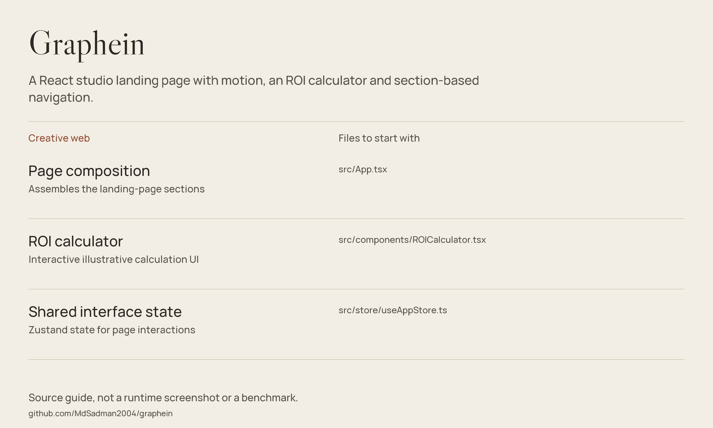

# Graphein

A React studio landing page with motion, an ROI calculator and section-based navigation.



*Source guide drawn from the files in this repository; not a runtime screenshot or a fresh benchmark.*

[Getting started](#getting-started) · [Source guide](#source-guide) · [Scope & limitations](#scope--limitations)

## What visitors can explore

- An animated hero and particle-graph visual.
- Services, use cases, process and FAQ sections.
- A client-side ROI calculator.
- Navigation, contact UI and shared interface state.

The components are authored for this studio presentation; this README replaces the untouched Vite scaffold.

## Getting started

Use a Node.js release compatible with **Vite 8** (Node 22.12+ or a newer supported LTS release):

```bash
git clone https://github.com/MdSadman2004/graphein.git
cd graphein
npm install
npm run dev
```

Open the URL printed by Vite. The declared commands are `npm run build`, `npm run preview` and `npm run lint`.

## Explore the source

[Hero](src/components/Hero.tsx) · [particle graph](src/components/ParticleGraph.tsx) · [services](src/components/Services.tsx) · [contact](src/components/Contact.tsx) · [palette](src/palette.ts) · [styles](src/index.css).

## Source guide

| Component | File | Purpose |
| :-- | :-- | :-- |
| Page composition | [src/App.tsx](src/App.tsx) | Assembles the landing-page sections |
| ROI calculator | [src/components/ROICalculator.tsx](src/components/ROICalculator.tsx) | Interactive illustrative calculation UI |
| Shared interface state | [src/store/useAppStore.ts](src/store/useAppStore.ts) | Zustand state for page interactions |

## Scope & limitations

Treat ROI figures, marketing statistics and testimonial content as presentation content, not independently verified customer outcomes. This checkout does not contain a production lead-delivery backend. A frontend build does not validate a business claim.

## Reuse & attribution

No standalone repository-wide license file is included in this checkout. Public source access is not a blanket license grant; check provenance and permissions before redistribution.
